Examples for Spark-LAMA can be found in examples/spark/.
These examples can be run both locally and remotely on a cluster.

To run examples locally one needs just ensure that data files lay in appropriate locations.
These locations typically /opt/spark_data directory.
(Data for the examples can be found in examples/data)

To run examples remotely on a cluster under Kubernetes control one needs 
to have installed and configured **kubectl** utility.
#### 1. Establish nfs / S3 
This step is necessary to make uploading of script file  
(e.g. executable of Spark LAMA) into a location that is accessible from anywhere on cluster.
This file will be used by spark driver which is also submitted to the cluster.
Upon configuring set appropriate value for *spark.kubernetes.file.upload.path* in ./bin/slamactl.sh or mount it to /mnt/nfs on the localhost.

#### 2. Create persistent volumes (PV) and claims (PVC)

Examples required 2 PVC for their functioning (defined in slamactl.sh, spark-submit arguments):
 - *spark-lama-data* - provides access for driver and executors to data
 - *mnt-nfs* - provide access for driver and executors to the mentioned above upload dir

#### 3. Define required env variables
Define required environment variables to use appropriate kubernetes namespace 
and remote docker repository accessible from anywhere in the cluster.
```shell
export KUBE_NAMESPACE=spark-lama-exps 
export REPO=node2.bdcl:5000 
```

#### 4. Build spark lama dependencies and docker images.
On this step use slamactl.sh utility to build dependencies and docker images:
```shell
./bin/slamactl.sh build-dist
```

It will: 
- compile jars containing Scala-based components 
  (currently only LAMLStringIndexer required for LE-family transformers)
  
- download Spark distro and use dockerfiles from there to build base pyspark images
  (and push these images to the remote docker repo)
  
- compile lama wheel (including spark subpackage) and build a docker image based upon mentioned above pyspark images
  (this image will be pushed to the remote repository too)
  
#### 5. Run an example on the remote cluster
To do that use the following command:
```shell
./bin/slamactl.sh submit-job ./examples/spark/tabular-preset-automl.py
```
The command submits a driver pod (using spark-submit) to the cluster which creates executor pods.

#### 6. Forward 4040 port to make Spark Web UI accessible.
The utility provides a command to make port forwording for the running example.
```shell
./bin/slamactl.sh port-forward ./examples/spark/tabular-preset-automl.py
```
The driver's 4040 port will be forwarded to http://localhost:9040.

## Run on local Hadoop YARN
Next, it will be shown how to run the `"examples/spark/tabular-preset-automl.py"` script for execution on local Hadoop YARN.

Local deployment of Hadoop YARN is done using the docker-hadoop project from the https://github.com/big-data-europe/docker-hadoop repository. It consists of the following services: datanode, historyserver, namenode, nodemanager, resourcemanager. The files `"docker-hadoop/nodemanager/Dockerfile"`, `"docker-hadoop/docker-compose.yml"` have been modified and a description of the new service `"docker-hadoop/spark-submit"` has been added. Required tools to get started to work with docker-hadoop project: Docker, Docker Compose and GNU Make. 

#### 1. First, let's go to the directory with the LightAutoML project
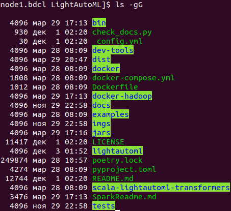

Make sure that in the `"dist"` directory there is a wheel assembly and in the `"jars"` directory there is a jar file.

If the `"dist"` directory does not exist, or if there are no files in it, then you need to build lama dist files. 
```
./bin/slamactl.sh build-lama-dist
```
If there are no jar file(s) in `"jars"` directory, then you need to build lama jar file(s).
```
./bin/slamactl.sh build-jars
```

#### 2. Copy lama wheel file from `"dist/LightAutoML-0.3.0-py3-none-any.whl"` to `"docker-hadoop/nodemanager/LightAutoML-0.3.0-py3-none-any.whl"`.
We copy the lama wheel assembly to the nodemanager Docker file, because later it will be needed in the nodemanager service to execute the pipelines that we will send to spark. 
```
cp dist/LightAutoML-0.3.0-py3-none-any.whl docker-hadoop/nodemanager/LightAutoML-0.3.0-py3-none-any.whl
```

#### 4. Go to `"docker-hadoop"` directory
```
cd docker-hadoop
```

#### 3. Open `"docker-compose.yml"` file and configure services. Edit `"volumes"` setting to mount directory with datasets to `"nodemanager1"` service.
```
nano docker-compose.yml
```
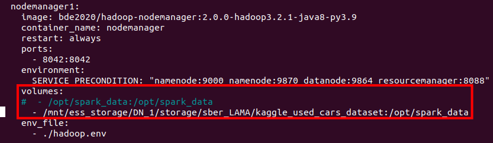

#### 4. Open `"hadoop.env"` file and configure hadoop settings.
Pay attention to the highlighted settings. They need to be set in accordance with the resources of your computers. 
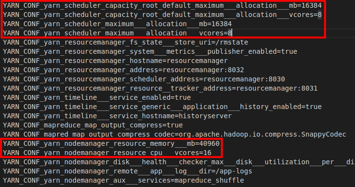

#### 5. Build image for `nodemanager` service.
The following command will build the `nodemanager` image according to `"docker-hadoop/nodemanager/Dockerfile"`. Python3.9 and the installation of the lama wheel package has been added to this Dockerfile.
```
make build-nodemanager-with-python
```

#### 6. Build image for `spark-submit` service.
The `spark-submit` container will be used to submit our applications for execution. 
```
make build-image-to-spark-submit
```

#### 7. Start Hadoop YARN services
```
docker-compose up
```
or same in detached mode
```
docker-compose up -d
```
Check that all services have started
```
docker-compose ps
```
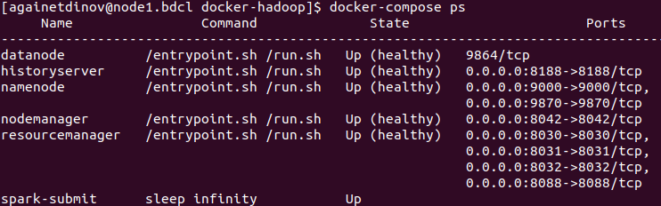

Here `datanode`, `historyserver`, `namenode`, `nodemanager`, `resourcemanager` is services of Hadoop. `namenode` and `datanode` is parts of HDFS. `resourcemanager`, `nodemanager` and `historyserver` is parts of YARN. For more information see the documentation at https://hadoop.apache.org/docs/r1.2.1/hdfs_design.html and https://hadoop.apache.org/docs/stable/hadoop-yarn/hadoop-yarn-site/YARN.html.

`spark-submit` is service to submitting our applications to Hadoop YARN for execution (see step 8).

If one of the services did not up, then you need to look at its logs. For example `resourcemanager` logs.
```
docker-compose logs -f resourcemanager
```

#### 8. Send job to cluster via `spark-submit` container
```
docker exec -ti spark-submit bash -c "./bin/slamactl.sh submit-job-yarn examples/spark/tabular-preset-automl.py"
```
#### 9. To track the execution of a applications, you can use the hadoop web interface (http://localhost:8088), which displays the status of the task, resources and application logs.
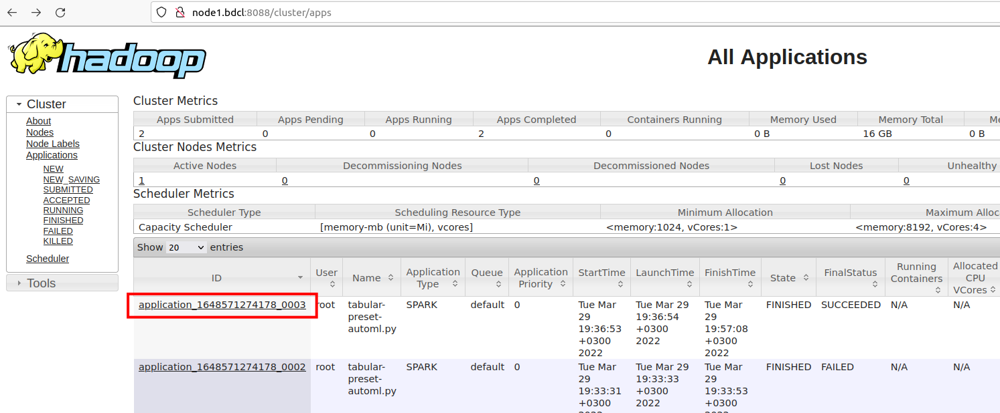
Let's see the information about the application and its logs.
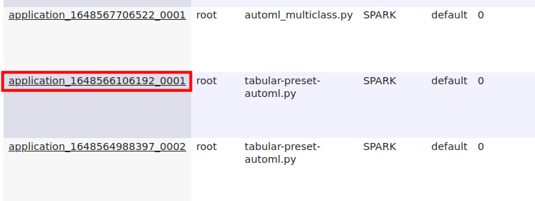

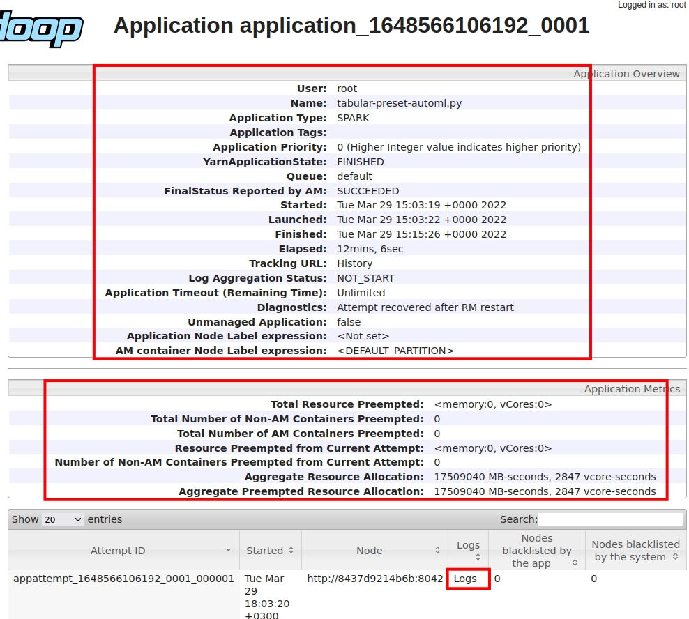

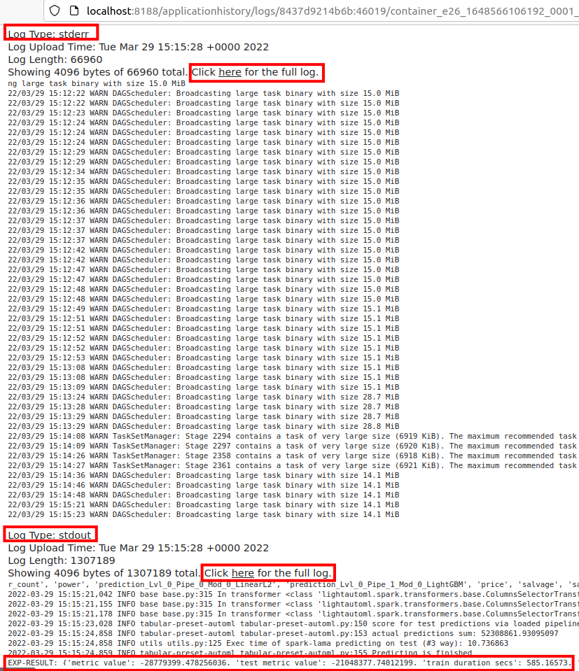

#### 12. When the application is running, you can go to the hadoop web interface and get a link to the Spark WebUI.
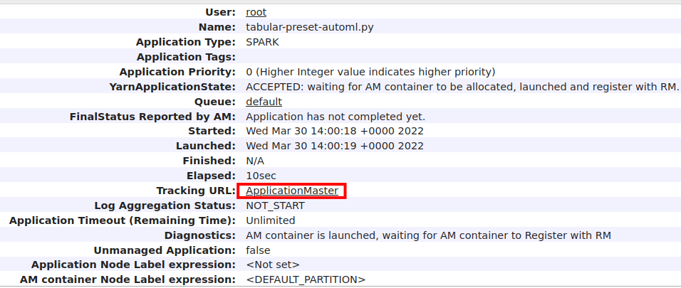
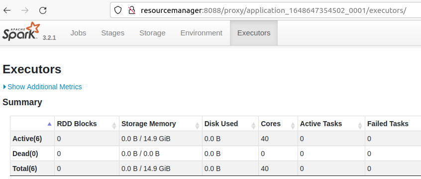

#### 11. Web interface of hdfs is available at http://localhost:9870. Here you can browse your files in hdfs http://localhost:9870/explorer.html. hdfs stores trained pipelines and Spark application files.
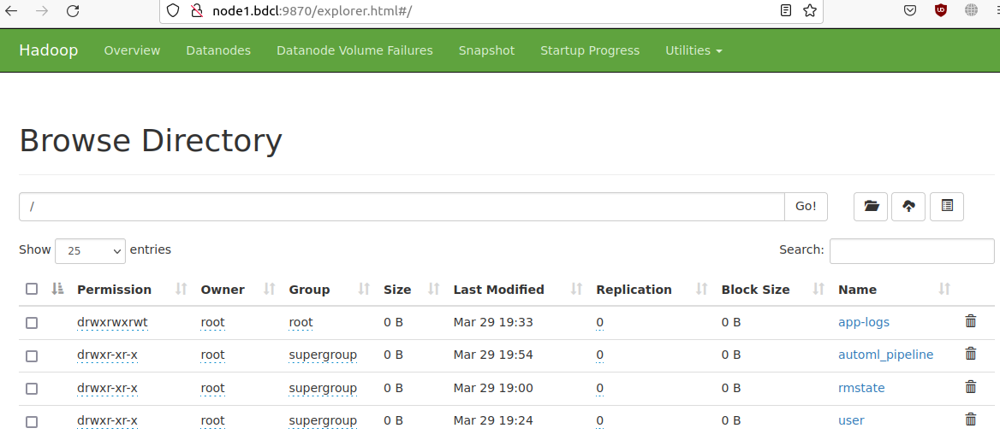
